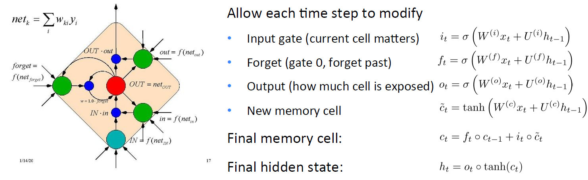
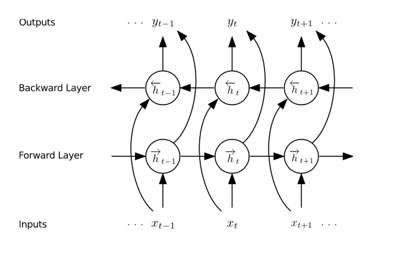
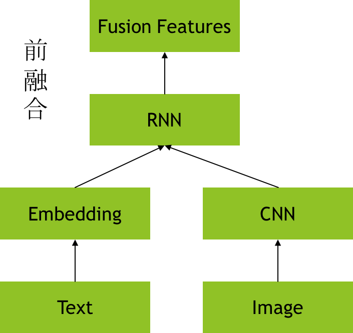
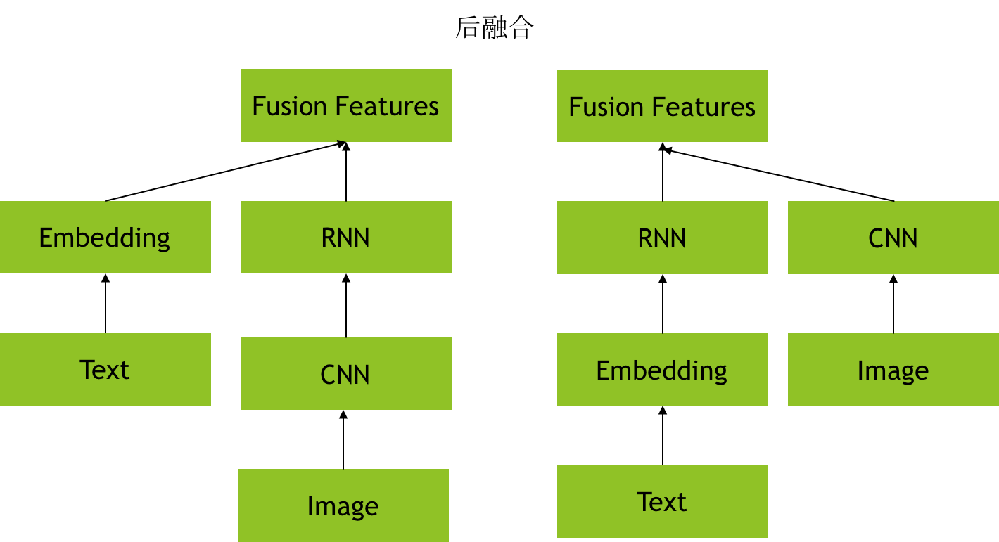
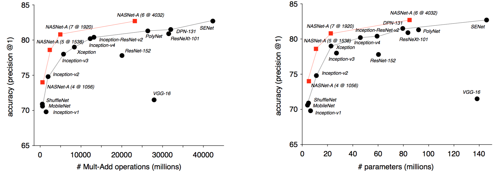
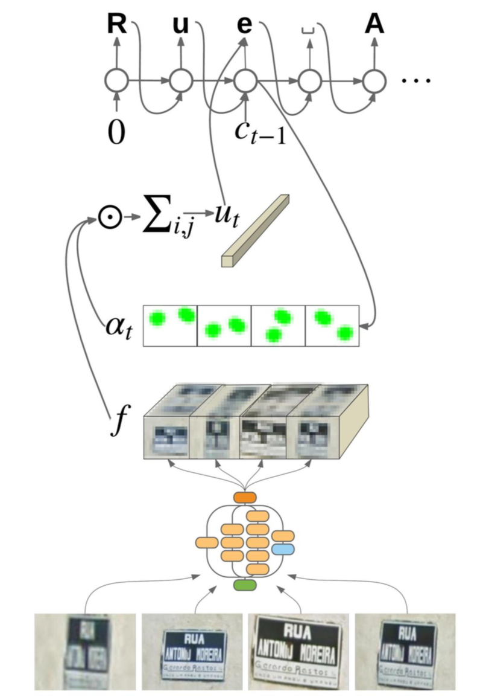
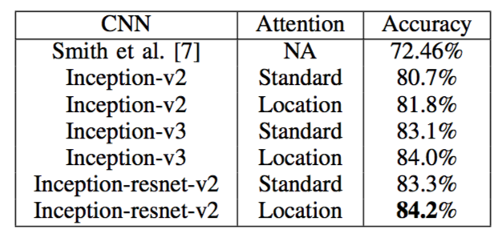
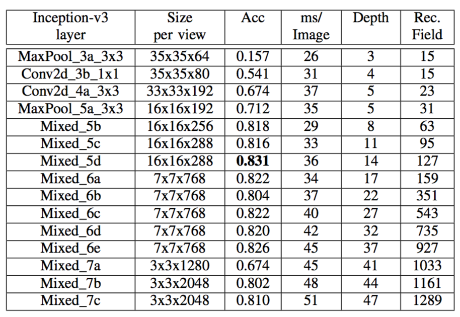

# [Attention-based Extraction of Structured Information from Street View Imagery](https://arxiv.org/abs/1704.03549)

基于attention的OCR文字识别模型，在FSNS数据集上，高于state-of-art 10个百分点，而且他的识别过程pipeline相对简单，不像原来的识别模型，需要把每一行单独对待，同时也无需使用CTC的损失函数。

一般来说，OCR过程包括两个部分，一个是检测，一个是识别，这个pipeline与人脸识别类似。

检测，就是把包括文字的区域检测出来，但是与人脸检测不同的是，文字识别不像人脸识别那样包括一些特别通用的pattern，这个检测的难度还是不小。

识别，就是把检测输出的包括文字的图像块里面的具体文字识别出来，这个地方与人脸识别也有所不同，通常来说人脸识别的识别阶段不是一个分类任务，而是一个最近邻匹配任务，但是OCR的识别则是一个文字的分类任务，而且是sequence的分类任务。

## 一、 Introduction
因为一张图像中包括的文字可能是一个也可能是若干个，所以OCR的识别是一个sequence的问题，而序列问题一般使用的就是RNN(Recurrent Neural Network)。

### 1. RNN中常用两种处理单元(Unit)
a.) GRU(Gated Recurrent Unit)是一般的RNN的改良版本，主要是从以下两个方面进行改进。一是，序列中不同的位置处的单词(已单词举例)对当前的隐藏层的状态的影响不同，越前面的影响越小，即每个前面状态对当前的影响进行了距离加权，距离越远，权值越小。

<div  align="center">    

</div>

b.) LSTM(Long short term memory)与GRU类似，目前非常流行。它与一般的RNNs结构本质上并没有什么不同，只是使用了不同的函数去去计算隐藏层的状态。在LSTMs中，i结构被称为cells，可以把cells看作是黑盒用以保存当前输入xt之前的保存的状态ht−1，这些cells更加一定的条件决定哪些cell抑制哪些cell兴奋。它们结合前面的状态、当前的记忆与当前的输入。已经证明，该网络结构在对长序列依赖问题中非常有效。

<div  align="center">    

</div>

关于RNN更详细的介绍，可以[参考文章](http://blog.csdn.net/heyongluoyao8/article/details/48636251)，进一步理解。

一般来说GRU和LSTM在作为RNN的基本处理单元的时候，最终的效果相差不多（一般LSTM会稍好一点），但是LSTM的计算复杂度相对来说比GRU会大很多，所以一般情况下哒遛君会使用GRU作为RNN的基本处理单元。

### 2. Layers and Bidirectial
a.) RNN与CNN或者DNN相同，同样可以形成若干曾的叠加，如果RNN的层数大于1，上一层的输出状态作为下一层的输入状态，RNN的层数最好不要使用太多，它不像CNN那样好训练，因为CNN是没有时间概念的，但是RNN有时序的问题，如果使用层数过多，会使得信息在传递的过程中消失或者梯度消失或者爆炸的问题。

<div  align="center">    

</div>

b.) Bidirectional RNN，双向RNN。由于RNN用于处理时间序列的问题，所以一般来说对于一个问题既可以正向看，也可以反向看，这就对应到了双向的RNN。

双向的RNN包括与多层的RNN不同的是，虽然也是包括两层的RNN，但是他们的输入方向是不同的，上一层的输出不会输入到下一层，而是直接绕过下一层，直接输出到output层，在output层相当于同一个节点，会包括最开始和最终的RNN状态。

<div  align="center">    

</div>


### 3. Attention
Attention一般需要用到RNN的前一状态，或者CNN的前一层输出。其核心目的是为了影响输入到下一层或者下一个状态的特征。

在[SCA-CNN](https://arxiv.org/abs/1611.05594)这篇论文中采用了两种Attention的模式，一个是spatial attention，另一个是channel wise attention。一般情况，attention都会是一个最大值为1的概率值，用户表征每一个feature的重要性。

SpatialAttention主要想捕捉到的是feature在空间的变化，这一点很重，因为我们关心的物体不可能出现在图像的全部区域，所以对图像的空间进行加权是很有必要的。

ChannelWiseAttention这个是对feature map的通道的加权，因为不同的feature map所对应的kernel会学到不同的pattern，当前的状态的kernel重要性肯定不应该是同等重要的。

目前这两种Attention的代码已经集成到了CangJe]项目中[components.attention](../../models/components/attention.py)模块中。

<div  align="center">    

</div>

### 4. Multimodal Fusion
多模态融合一般用在输入源是不同类别的信号，经常用到多模态融合的是语音、图像、文本信息的融合，OCR只涉及到了图像、文本信息的融合。

在图文序列的多模态融合的玩法多种多样，一般包括前融合和后融合。

> a.) 前融合
<div  align="center">    

</div>

---

> b.) 后融合
<div  align="center">    

</div>

## 二、 Algorithm
这篇论文是做OCR识别的算法，主要使用到的技术包括：

> 1. CNN，用于提取图片的底层特征。
> 2. RNN，用于处理文字序列问题。
> 3. Spatial attention，根据不同的阶段，改善CNN的特征。

### 1. CNN -- Image Feature
论文中作者使用了3中主流的网络结构，`inception-v2`, `inception-v3`, `inception-resnet-v2`(目前这三个模型在[CangJe.models.nets](../../models/README.md)中都提供了分类模型的自动化执行，修改`--model_name`可以指定任意的模型。)。作者实验发现准确率呈逐渐增加的模式，但是`inception-v3`与`inception-resnet-v2`的准确率相差无几，但是他们的计算量却差别很大。如图：

>

由于字母或者文字一般最主要的是边缘和角的特征，在应用模型的时候，不需要太高语义层级的特征，这里经过验证作者使用的是`inception_v3`的`Mixed_5d`输出的特征作为图像的特征。

### 2. RNN -- Multimodal Fusion
实验中作者使用的是前面讲的前融合的方式，即每一步RNN的输入为:
```math
\hat{a}_t=W_cc_{t-1}^{OneHot}+W_{u1}u_{t-1}
```
`c`是上一个字符的index，这里经过了一个one-hot编码，其实说白了，前面就是一个Embedding的过程。`u`是attention CNN features。

### 3. SpatialAttention
以前的spatialAttention是没有位置编码信息的，型如：
```math
a_{t,i,j}=V_a^Ttanh(W_ss_t+W_ff_{i,j,:})
```

```math
\alpha _t=softmax_{i,j}(a_t)
```

但是作者认为这种attention机制不够`location aware`, 所以他把空间的位置也进行编码加入到了attention中，作者把位置信息进行的Embedding编码。所以变成了如下：
```math
a_{t,i,j}=V_a^Ttanh(W_ss_t+W_{f1}f_{i,j,:}+W_{f2}e_i+W_{f3}e_j)
```
><div  align="center">    

</div>

### 4. Architecture
<div  align="center">    

</div>

## 三、 Experiment
论文得出2个结论：
>1. 对于文字识别这种任务，高层的特征反而不如底层特征，因为文字识别这个任务本身更关注边缘和角的信息。
>2. SpatialAttention加上了位置信息编码会有效果会有所提升。

<div  align="center">    

<p> 实验结果对比 </p>

<p> inception_v3不同层特征对比 </p>
</div>

## 四、 One More Thing
1. 发现了一个初始化RNN的不错的算法，详细参见[http://smerity.com/articles/2016/orthogonal_init.html](http://smerity.com/articles/2016/orthogonal_init.html)号称可以解决RNN在step迭代的时候梯度消失或者爆炸的问题。目前该初始化方法已经剥离到了[CangJe.models.components.initialization](../../models/components/initialization.py)。
2. 一个可以编码位置信息的组件加入到了[CangJe.models.components.location_encoder](../../models/components/location_encoder.py)
3. tensorflow增加了[sequence learning](https://www.tensorflow.org/api_docs/python/tf/contrib/legacy_seq2seq)的模块，可以研究一下。
