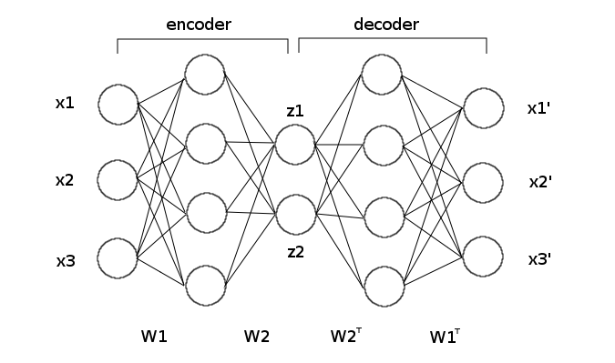
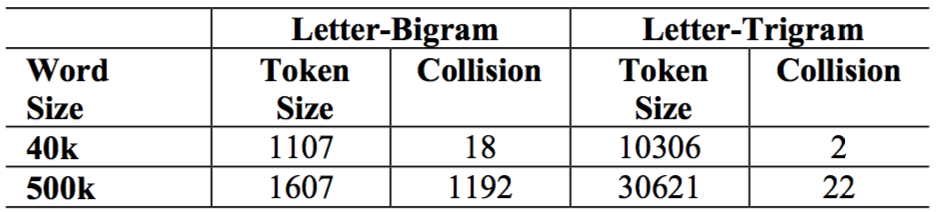
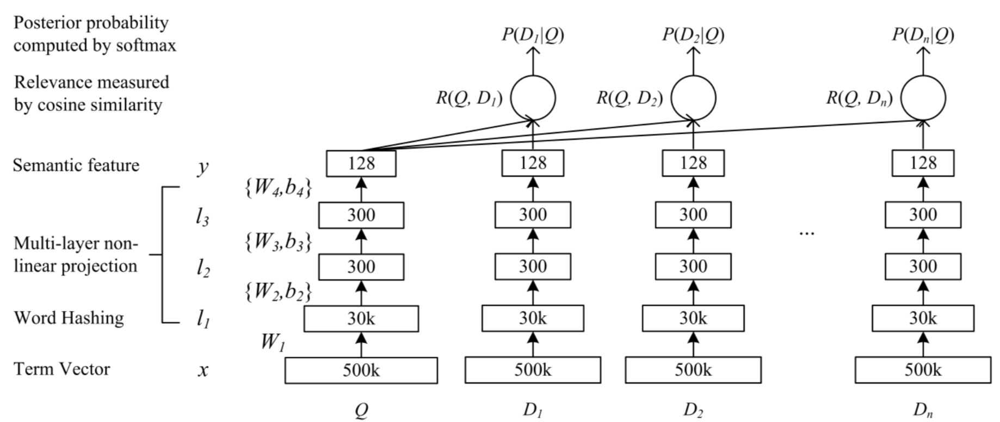
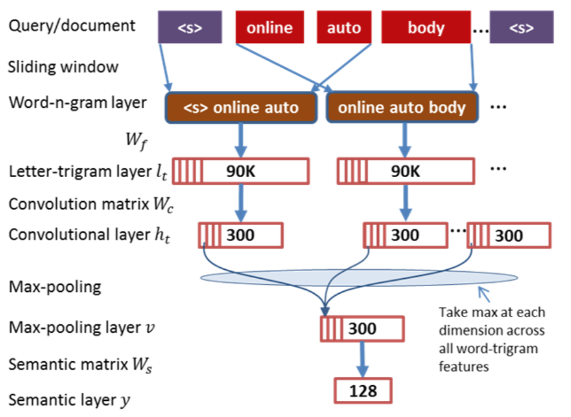
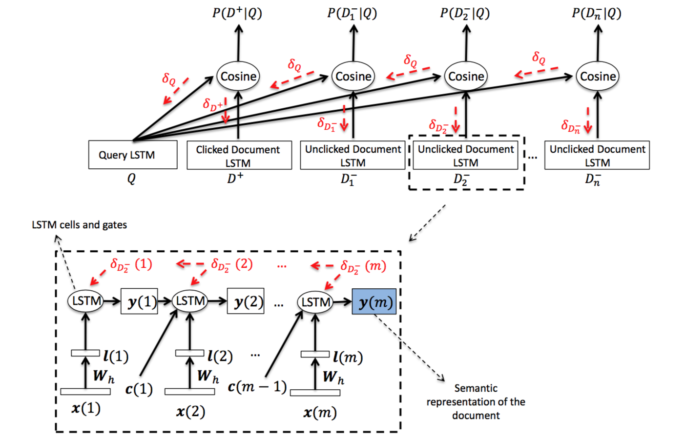
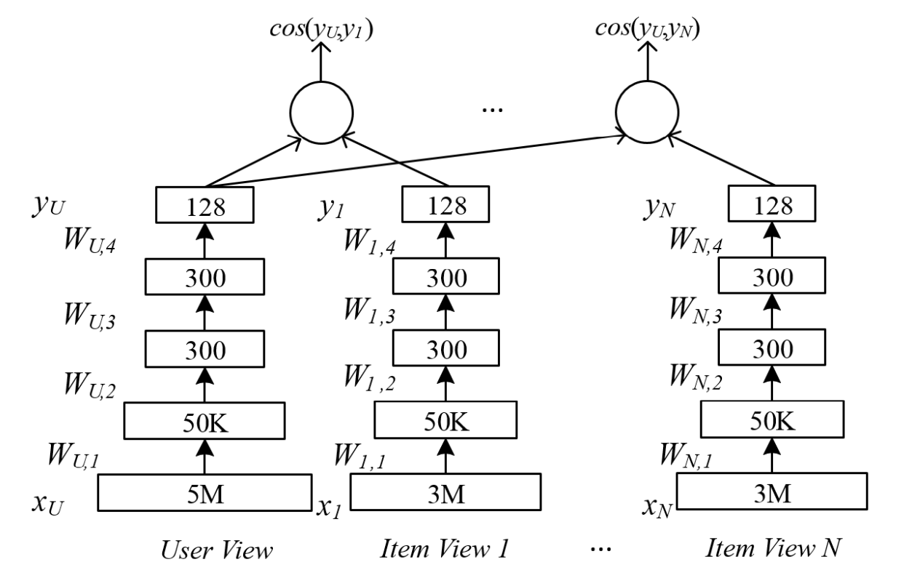

# DSSMs: Deep Structured Semantic Models

[DSSM(Deep Structured Semantic Model)](https://www.microsoft.com/en-us/research/publication/learning-deep-structured-semantic-models-for-web-search-using-clickthrough-data/):基于深度网络的语义模型，这篇论文的核心思想是把文本数据以及用户的点击历史记录映射到一个相同维度的语义空间，通过最大化两个空间的cosine相似度，最终达到信息检索的目的。

DSSM这篇论文是在13年被首次提出，14，15经过两年的发展，分别演化出了基于卷积网络的[C-DSSM(Convolutional DSSM)](http://www.iro.umontreal.ca/~lisa/pointeurs/ir0895-he-2.pdf)、基于循环神经网络的[R-DSSM(Recurrent DSSM)](https://arxiv.org/abs/1412.6629)、针对不同信息来源的[MV-DSSM(Multi-View DSSM)](http://sonyis.me/paperpdf/frp1159-songA-www-2015.pdf)、最后还有一个专门针对Caption的[DMSM(Deep Multimodal Similarity Model)](https://arxiv.org/abs/1411.4952)。

注：C-DSSM在论文里面的模型名称叫CLSM(Convolutional Latent Semantic Model)，但是为了前后的连贯性，Dr.Sure就私自改成了C-DSSM。

DSSM的设计初衷是为了做信息检索（IR，应用到搜索引擎），但是后来逐渐被演化到不同数据源的语义空间映射问题，包括但是不仅仅包括信息检索、图文匹配、Caption、Sent2Vec。

这几个相关工作都有[Xiaodong He](https://www.microsoft.com/en-us/research/people/xiaohe/)的工作，他在CVPR2015上做了一个主题报告，专门针对DSSM以及内容理解做了一个比较详细的阐述，[详见PPT](https://www.microsoft.com/en-us/research/wp-content/uploads/2016/02/CVPR15_DeepVision_XiaodongHe.pdf)。他在slides里面highlight出来的一些问题，感觉相当有参考价值。

这个博客汇总了13年到15年5篇论文有关DSSM的相关工作，详细介绍DSSM相关算法的发展。

## 一、 DSSM: Deep Structured Semantic Models
从模型的名称中可以看出，这个模型是基于深度学习的算法，并且是将数据映射到一个语义空间的模型。所以相比于以往其它的语义模型来说，最大的优势就是引入了深度网络。

### 1. 相关Semantic Models
#### a.) Latent Semantic Models

这些模型里面最常被提及的就是Latent Semantic Analysis(LSA)、Probabilistic LSA(PLSA)以及LDA等，这些都是基于无监督的模型，而且大部分是基于矩阵分析以及概率模型的基础建立而来。对于不同单词的相同语义不能很好的建模。这里引用He博士在slides中的一个例子：

```
Minnesota became a state on?
When was the state Minnesota created?
```

这个例子只有`Minnesota state`关键词是共享的，句式包括其他的单词和句式都不相同，这样的数据放到传统的语义模型中很可能不会被映射到一个相同的语义空间，然而对于理解来说，这两句话的语义是完全相同的。

#### b.) Auto Encoder Decoder
前面基于矩阵分析的模型存在最大的问题就是算法为无监督的，虽然这些算法具有很强的鲁棒性，但是真是的应用场景中，每个任务的目标函数各不相同，这就好像用一个瑞士军刀削一个苹果，反而不如一个更合适的水果刀。

Auto encoder decoder的提出就是想解决上面的一些问题，使用深度网络，引入监督信息，通过encoder编码输入数据，映射到一个语义空间，然后在用decoder还原成原始数据。

其网络结构如下：

<div align="center">    

</div>

可以看到，一个高纬度的输入数据`x`，通过encoder降维到一个比较小的空间`z`，然后通过decoder还原输入数据，使用深度网络进行监督，最后`z`表示`x`，当做`x`在低纬度的一个表达。

Auto encoder最明显的好处是通过引入深度网络，通过监督信息，将数据降到一个低纬度的空间。但是它同样存在缺点，就是同样是无监督的，依然不能针对具体问题进行求解。

无论是LSA、LDA还是Auto encoder，都存在一个问题就是，无法应对字典爆炸的问题，随着字典规模的爆炸，这些算法的复杂度也随之不可控，所以在大规模数据下，这些算法都是很受局限的。

### 2. DSSM算法
DSSM的提出致力于解决传统算法中无法解决的两个问题：

1. 数据规模

	> 在现有的Web Data，数据规模是相当大的，传统方法对对大规模数据的扩展性很差，而且不能处理没有见过的单词。

2. 语义空间映射
	
	> 根据不同的任务，引入具体场景的监督信息。

### 3. Word Hashing
通过对单词进行hash，解决数据规模问题。算法的核心出发点就是改变原来单词的one-hot编码方式，因为这种编码方式，带来了太多的数据浪费（一个vector中只有1个位置的信息起作用），所以作者想把one-hot改成multi-hot。具体做法如下：

1. Query以及Doc使用字符的Trigram表示。

	>例如，#Query#，可以表示成`#Qu`,`Que`,`#uer`,`#ery`,`ry#`
	
2. 对新的Trigram表示的单词进行统计，类似于one-hot, 只不过同一个单词，出现过的三元组即在对应位置`+1`，最后形成一个multi-hot的编码。

这样的hash方法，可能带来的一个问题是碰撞的问题，但是作者统计过，这样的碰撞概率极低，统计结果如下。发生碰撞的几率极小。

<div align="center">    

</div>

Word hashing有一个明显的好处就是可以解决字典爆炸的问题，即问题的规模不会随着单词各个数增长出现增长，因为所有Trigram只有3个字符，每个字符出现的可能性是有限的，所以在大规模的Web Data是可以轻松应对的。

另外一个明显的好处是，这样的hash算法，对`Unseen`的单词特别鲁邦，所以可以完美解决任意Query的问题。

### 4. DNN for Computing Semantic Features
这个是模型的核心算法，把映射到相同语义空间的特征，通过Cosine距离描述Query和Doc的相关性。

$$R(Q,D)=consine(y_Q,y_D)=\frac{y_Q^Ty_D}{|y_Q||y_D|}$$

由于Web的搜索，存在大量的用户点击行为，这里作者将点击的数据当成正样本（Query与Doc相关），未点击的数据当做不相关，最后构建如下图的模型：

<div align="center">    

</div>

500k的所有的单词数，30k是使用Word Hashing算法之后的数据规模，经过3层的DNN，将Query与Doc降低到相同的128的空间，通过上面的Cosine测度，度量5个Doc（1个点击的相关Doc，其余的4个为随机挑选的不相关的Doc），最后对Query与5个Doc的相关性使用Softmax归一化，使用交叉熵优化模型。

这里我的理解是Query有器单独的模型，其余所有的正负样本的Doc公用一个模型。

> trick，最后128的特征输出的激活函数是`tanh`.

### 5. Conclusion
DSSM的开山之作，提出了2个特别新颖的方法:

1. Word Hashing解决大规模数据向的字典爆炸问题。
2. 引入监督信息，使用用户点击数据，优化语义空间映射问题。

## 二、C-DSSM: Convolutional DSSM

### 1. Model
基于卷积的DSSM，由于原始的DSSM所有的单词相当于是单独来看，而且Query和Doc都是Bag of words，句子之间的联系就被词袋模型给抹杀掉了，所以作者通过引入卷积操作，尽量地捕捉单词的相关性。

作者的引入了一维的卷积，对文本进行卷积操作。这里作者使用的卷积核大小为`1×3`。网络结构如下：

<div align="center">    

</div>

对单词的处理与原始的DSSM相同，是基于Trigram的Hash算法。然后通过`1×3`卷积核，`stride=1`把一个Doc(或Query)卷积出若干的feature map，然后feature map对应维度进行MaxPooling，最后降维到128维的语义空间。

这里需要多说一句就是为什么会使用`Max-Pooling`这种操作。

引用文中的一句话：

```
force the network to retain only the most useful local features produced by the convolutional layers.
```
也就是最大程度地保留局部特征，这一点跟图像上相同。

### 2. Rethink
最后基于卷积的模型，要比原始的模型好10%左右，所以需要思考，为什么一个卷积的引入，就会造成这么大的性能提升？Dr.Sure有几点思考，分享如下：

1. `Bag of Words`算法是有问题的，单词之间的相关性，句法等相关，都因为求了一个Set操作，被消失殆尽，所以作者引入了卷积，这样卷积核就可以看到3个单词，捕捉到3个单词之间的相关性。

2. `Maxpooling`，这种pooling方式确实可以保证最后任务相关层的特征信息最有用话，因为这个神经元之间是`激活-响应`的关心，肯定是激活得越大，证明该神经元约起作用，如果使用`AveragePooling`可能会因为神经元太多，把一些有用的信息平均掉。

3. `C-DSSM`卷积操作仍然有很大的提升空间，因为一层的卷积只能看到3个单词，这仍然有问题，句子的信息仍然没有捕捉到，说到底是`感受野`的问题，这个地方可以通过多层的卷积解决。

## 三、R-DSSM: Recurrent DSSM
这个工作是在C-DSSM上的进一步改进，由于卷积无法捕捉单词之间的相关性，很明显更就要想到使用RNN解决这个问题。

网络结构如下：
<div align="center">    

</div>

网络结构大体不变，仅是把CNN替换成了RNN用于捕捉序列问题的相关性。

## 四、MV-DSSM: Multi-View DSSM
这个工作同样是对DSSM的改进，将其用于用户推荐。与C-DSSM与R-DSSM不同的是，他没有改变网络结构，而是从信息源入手解决这个问题。

众所周知，现在一个微信的账号可以在各种不同的平台进行登录，也就是说我们同一个账号可以在不同的App上产生不同交互行为，这样也就对应着越来越多的信息源，每一种信息源都包含着这个用户的某种习惯。

作者在文中举了这样一个例子，微软的用户的ID，可能在Bing上搜索皇马的比赛，很有可能就会在Xbox上下载FIFA的足球游戏。不同的信息源都对相同的用户进行了一些刻画，所以综合做种信息源，可以对用户的偏好进行描述，然后进行推荐。

整个模型如下：
<div align="center">    

</div>

核心的思想是把用户的特征与所有的item(不同的信息源)统一降维到一个相同的语义空间，通过Cosine距离表征User-Item的相关性。这里的每一个User-Item对相当于是一个DSSM模型，每一个Item的模型独立，但是共享同一个User模型。

其算法如下：
<div align="center">    

</div>

## 五、DMSM: Deep Multimodal Similarity Model
DMSM的核心思想仍然出自DSSM，但是与前面的四种算法最大的不同就是信息源不同，前面的四种模型针对的数据源都是Raw Data即用户最原始的点击log等等。但是DMSM是首次使用到图像的相关算法。

这个算法的引入是为了解决Caption中，预测输出的句子与图像匹配的问题，然后最大化这个相关性作为最后的一个输出结果。

这里可以把预测结果当成Query，把图像当成Doc，只不过这个Doc跟Query不是公用相同的网络结构，它的特征是使用基于CNN的网络特征降维得到。

## 六、 总结
1. 对于有些问题，如果没有负样本，例如最后的DMSM负样本最好使用online的模式构建，而不是提前写好。
2. DSSM的模型构建了各种不同信息源到同一个语义空间的桥梁，包括但不仅限于行为数据、图像数据、文本数据、语音数据。
3. DSSM看起来在真实检索场景下可行性很高，最真实的点击行为数据，直接用来优化线上的表现。
2. DSSM出的结果不仅可以直接排序，还可以用semantic feature作为Doc的Embedding。
