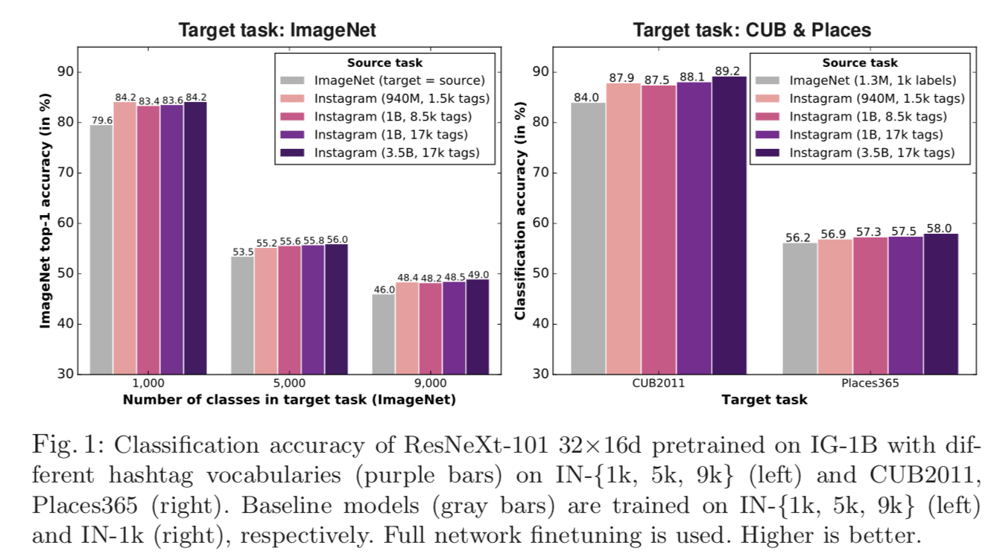
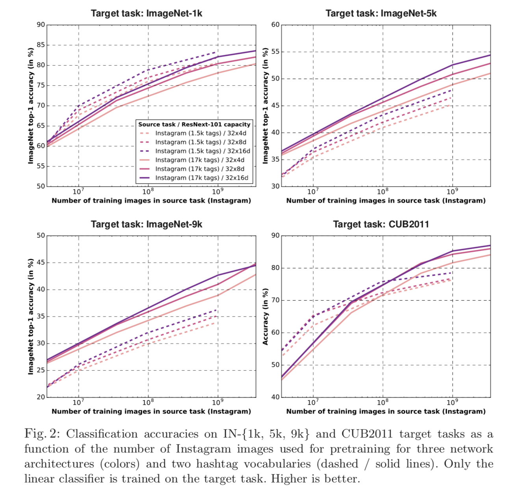
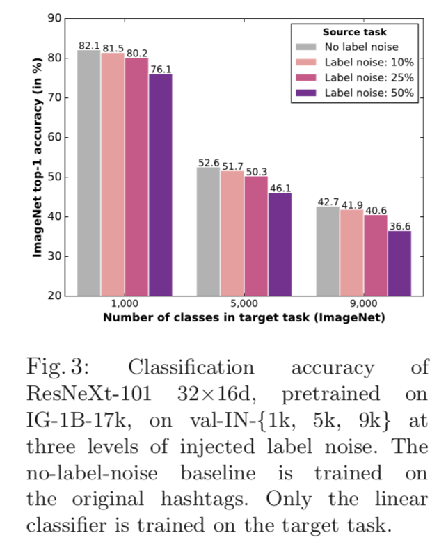
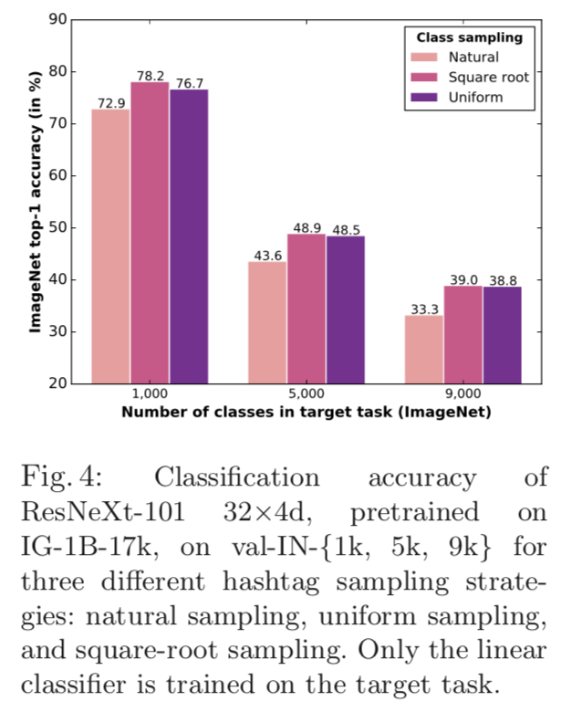
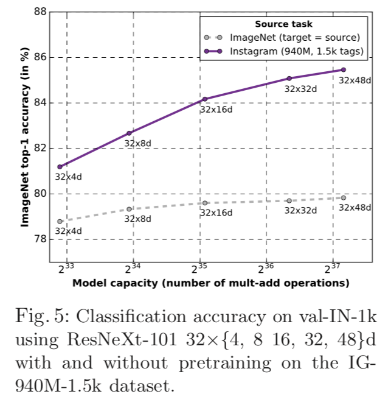

# Thinking in Weakly Supervised Learning
近期Dr.Sure看了一篇关于弱监督学习的文章——[Exploring the Limits of Weakly Supervised Pretraining](https://arxiv.org/abs/1805.00932)。这个工作是Facebook的人搞的，不得不佩服FB的大厂风范，竟然有这么多的计算资源让这帮人瞎折腾。当然顺带着看了一下这篇论文参考的两篇前作——[Revisiting Unreasonable Effectiveness of Data in Deep Learning Era](https://arxiv.org/abs/1707.02968),[Learning Visual Features from Large Weakly Supervised Data](https://arxiv.org/abs/1511.02251)，这两个工作也是一个Google的一个Facebook，大厂就是大厂。

实验大家就不要想着怎么复现了，其实也没有什么必要复现（即使你想复现，等训练完，估计你都老了）。大家看一下他的结论就好了，他们得出来的一些结论对我们在实际场景中应用的帮助还是挺大的。

## Weakly Supervised Learning
首先需要知道什么事弱监督学习，所谓弱监督学习就是与强监督学习对应的，这个主要是针对数据集而言的。其中后者比较有代表性的就是ImageNet、Coco这种数据，数据集中所有的样本都是精准、完全标注的。弱监督学习强调是在一个“弱”字，即数据集中的样本可能出现标注错误，标注不全的情况。

与其说是CNN引领了这一波深度学习的浪潮，Dr.Sure更觉得是不断增大的数据集为这波浪潮起到了推波助澜的作用。但是这波浪潮逐渐在偃旗息鼓，开源的大数据集近几年都没有显著增加，而且数据规模也没有比以前有太大的提升。

很显然，我们每天都在移动网络产生着大量的数据，只不过标注数据需要花费大量的人力成本，而且随着进入WebData时代，每家公司都对自己的数据讳莫如深，这就解释了为什么2017年ImageNet关闭了比赛。

虽然获取千万甚至上亿级别的标注数据变得几乎不可能，但是在社交媒体上，我们同样可以收集到大量的数据，这些数据有些是带有标签的，当然也有些标签是错误的。这就给了弱监督学习研究的必要，虽然数据不准、不全，但是重要多。

## Task and Dataset
弱监督学习目前普遍首先应用在图像的分类任务上，在论文中数据使用的是Instagram的3.5B的数据，熟悉Ins的人都知道，Ins上可以允许用户为每一个图片打上若干个标签，所谓的HashTag。这些标签对应的数据就被用在训练这个分类网络。

当然这3.5B的数据在使用的过程中经过了去重。同时因为不同的标签可能对应同样的意思，例如：`#brownbear`和`#ursusarctos`都表示`棕熊`，作者使用了wordnet对这类的标签进行了合并。 

作者使用这3.5B的数据训练了`ResNext`分类模型，并将这个模型的中间特征迁移到了Obj-Detection任务中，看看基于弱监督数据训练的模型特征的表达能力。

## Conclusion
实验没有太多的Trick，直接看结论。

### 1. How does the Instagram hashtag set impact accuracy?

在ImageNet 1000类分类的分类任务上，使用3.5B的数据训练的模型，在迁移到1000类的分类上，提升了4.8%的top1准确率。

    

可以看到效果提升确实还是十分明显的，证明35亿的数据确实对分类问题有一个极大的提升，所以想如何提升分类模型的精度问题上，最简单粗暴的就是——如何增加数据。

### 2. How does the pretraining image set size impact accuracy?

这个地方研究的是pretrained的模型用于提取特征对分类精度的影响。实验中作者并没有使用ImageNet完全去fintune全部的网络参数，而是fix除最后一层的线性分类器，仅训练最后一层的参数，因为作者考虑到如果fintune全部网络参数，ImageNet本身数据量就很大（1M），这样的话原始的参数会被淹没掉。

    

这个实验结果的信息量非常大：

1. 首先从四张图的趋势可以看到，随着数据量级的增长，准确率在逐渐提升。最主要是跟数据集的数量级呈log线性。

2. 这四张图的性能的增长率基本上是逐渐放缓的态势，也就是说在百万量级的训练数据，对于ResNext模型来说，是处于一种模型欠拟合状态，也就是说没有达到这个模型能力的上限。但是随着数据量级的提升，逐渐达到了模型的capacity。

3. 左上角的结果非常有趣，17k的标签体系竟然不如1.5k的标签体系训练出来的模型特征表达能力要强，文中作者指出，1.5k的标签更接近ImageNet的1k标签，所以它的效果要更好。这个也就提醒了我们，不是我们的标签体系的标签越多，模型特征迁移到某个任务时就会越好，这个跟Dr.Sure在真实应用场景的结论不谋而合。换句话说也就是我们仍然需要针对具体的任务具体分析，选取尽可能贴近具体任务的标签以及数据去训练模型，毕竟模型在应用的时候有一个假设就是训练集和测试集是独立同分布的。

### 3. What is the effect of hashtag label noise on model accuracy?

这个也许是我们在训练模型的时候非常关心的一个事情——训练数据不准怎么办？作者在原始的hashtag上随机引入了%p的噪声标签，下面是实验结果。

    

从文中结论可以看到随着噪声数据的增加，模型的准确率确实下降了，但是有一点需要强调的是，没有下降到不可用的状态。

Dr.Sure在刚开始做分类的时候，有些分类的任务会给外包去标注，当让我们希望他们能够尽可能地标注准确，但是很显然人无完人，人工也不能标注完全准确。开始的做法是低于%p的标注数据直接清理掉要求标注人员重新标注，现在看来是多么无知。

模型是否可以训练，不在于数据是不是完全准确，而在于问题有没有定义清楚。

### 4. How does the sampling of pretraing data impact accuracy?

这个问题要研究的是样本分布不均衡的情况，很显然用户总是喜欢打一些比较常见的标签，这个标签的分布符合Zipfian分布，直接使用这些数据进行训练，肯定会有不好的影响（常见标签的数据梯度覆盖掉了不常见标签的梯度）。所以作者调研了数据抽样的影响。

    

可以看到在有同样常见的App在训练模型的时候，数据抽样也有很大的借鉴意义。

### 5. With billions of images is transfer learning model-capacity bound?

数十亿的训练数据是不是达到了模型能力的极限，作者使用相同的数据集，对比了不同模型的能力。

    

可以看到在小量数据集时（ImageNet）,随着模型复杂度的增加，模型提升相对较少，也就是说这个时候模型并不是限制小数据集的核心因素。但是当数据集增加到940M时，随着模型复杂度的提升，模型的capacity逐渐成为了瓶颈，这个时候就需要设计更复杂的模型去拟合这些数据。

### 6. On what visual classes is Instagram pretraining most helpful?

这个问题核心需要研究的就是问题定义的事情，也就是我们在训练模型的时候需要首先定义好需要迁移到的目标的问题，例如一个需要区分“男”，“女”的分类器，我们使用大量的“年龄”、“颜值”的数据进行预训练，显然会南辕北辙。

这里引用文中的一句话：Our results with different hashtag vocabularies suggest that choosing the right hashtag vocabulary may be at least as important as scaling model training to billions of images. 

这个与问题2的结果相同，所以选对的大于选多的。

## One More Thing

最后来看一下这个实验的机器配置。

文中作者使用了336块GPU，batchsize的大小是8064（Large！参考[Accurate, Large Minibatch SGD: Training ImageNet in 1 Hour](https://arxiv.org/abs/1706.02677v1)）

Our ResNeXt-101 32×16d networks took ∼22 days to train on 3.5B images.

感受一下，科研不仅仅拼智商，还拼你的东家是不是足够给力！

## Reference
1. Mahajan D, Girshick R, Ramanathan V, et al. Exploring the Limits of Weakly Supervised Pretraining[J]. arXiv preprint arXiv:1805.00932, 2018.

2. Sun C, Shrivastava A, Singh S, et al. Revisiting unreasonable effectiveness of data in deep learning era[C]//2017 IEEE International Conference on Computer Vision (ICCV). IEEE, 2017: 843-852.

3. Joulin A, van der Maaten L, Jabri A, et al. Learning visual features from large weakly supervised data[C]//European Conference on Computer Vision. Springer, Cham, 2016: 67-84.

4. Goyal P, Dollár P, Girshick R, et al. Accurate, Large Minibatch SGD: Training ImageNet in 1 Hour[J]. 2017.