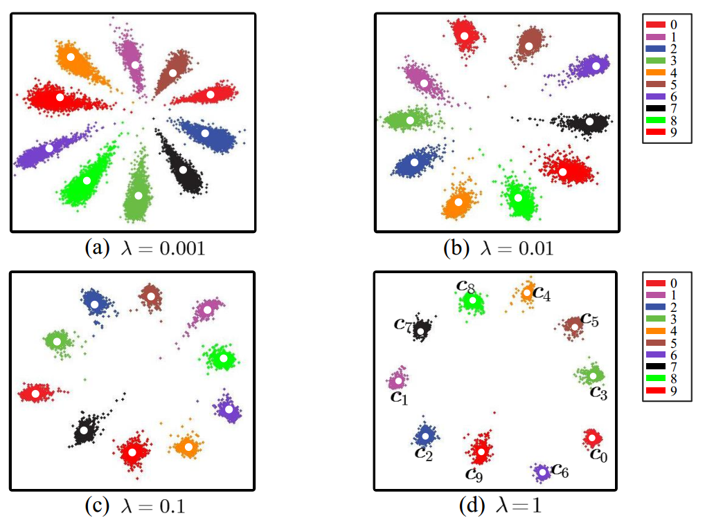
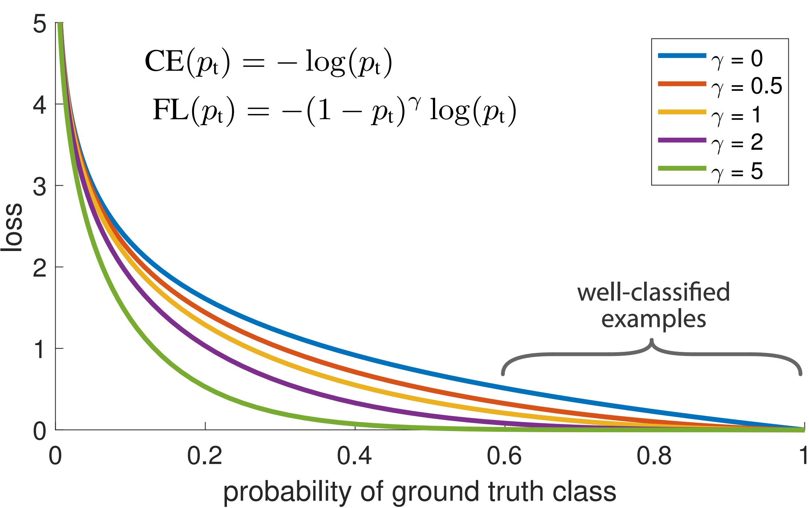

# Losses

介绍Tensorflow中主要的几个loss函数以及在[CanJe](../../models/components/losses.py)项目中自定义添加的诸如：`CenterLoss`, `FocalLoss`等损失函数。

## Tensorflow
这一小节主要介绍Tensorflow中的loss以及相应的使用方法。

### 1. L<sub>n</sub> 损失
最常用的loss是L<sub>1</sub>正则化损失函数以及L<sub>2</sub>损失函数。

> #### L<sub>1</sub> 损失函数
>
>`tf.nn.l1_loss`对所输入的参数的绝对值进行加和，即为最后的loss。
>
>```python
loss = tf.multiply(weight, tf.reduce_sum(tf.abs(weights)), name='value')
```
	
> L<sub>1</sub>可以使学到的参数尽可能地趋向于0，达到稀疏化的目的，但是这种loss所产生的稀疏化在整个参数空间中是均匀分布的，所以如果想使用L<sub>1</sub>训练好的参数进行加速所起到的加速效果一般。一种更好的结构化稀疏方式参见[SSL](http://www.wangqingbaidu.cn/article/dlp1487819548.html)。

---

> #### L<sub>2</sub> 损失函数
>
>`tf.nn.l2_loss`对所输入的参数的平方和，即为最后的loss。
>
>```python
loss = tf.multiply(weight, tf.reduce_sum(weights ** 2) / 2, name='value')
```
	
> L<sub>2</sub>可以防止过拟合。一般会直接添加到最后的损失函数中，但是会有`scale`参数作为一个这项损失函数的放缩因子。

### 2. CrossEntropy损失
下面的代码为交叉熵损失的原始表示方式，其中`prob(x)`为获取模型输出结果的概率函数，这里可以是`sigmoid`或者`softmax`。

```python
x = logits, z = labels, p = prob(x)
CE= z * -log(p) - (1 - z) * log(1 - p)
```
化简之后的交叉熵损失函数对`weights`的偏导为, [`推导过程详见`](https://hit-scir.gitbooks.io/neural-networks-and-deep-learning-zh_cn/content/chap3/c3s1.html):

<div  align="center">    

</div>

交叉熵是正的，并且当所有输入x的输出都能接近期望输出y的话，交叉熵的值将会接近1。这两个特征在直觉上我们都会觉得它适合做代价函数。事实上，我们的均方代价函数也同时满足这两个特征。这对于交叉熵来说是一个好消息。而且交叉熵有另一个均方代价函数不具备的特征，它能够避免学习速率降低的情况。

> #### SigmoidCrossEntropy损失函数
> 
> [`tf.losses.sigmoid_cross_entropy`](https://www.tensorflow.org/versions/master/api_docs/python/tf/losses/sigmoid_cross_entropy)，对输入的`logits`使用`sigmoid`函数进行激活，然后使用交叉熵的公式计算损失，这个方法不要求所有的label之间互斥，例如模型一次要判断100张图是否包含10种动物，这两个输入的shape都是[100, 10]。注释中还提到这10个分类之间是独立的、不要求是互斥，这种问题我们成为多目标，例如判断图片中是否包含10种动物，label值可以包含多个1或0个1。

> ```python
> sigmoid_cross_entropy(
    multi_class_labels,
    logits,
    weights=1.0,
    label_smoothing=0,
    scope=None,
    loss_collection=tf.GraphKeys.LOSSES,
    reduction=Reduction.SUM_BY_NONZERO_WEIGHTS
)
> ```
> 输入`logits`是最后一层网络的未经过激活函数的数值，`labels`为真实结果，但是需要是[one-hot编码](https://www.tensorflow.org/api_docs/python/tf/one_hot)之后的数据。使用`sigmoid`的交叉熵损失，最后每一个label的加和概率是相互独立的，也就是最后的概率之和可能会大于1。

---

> #### SoftmaxCrossEntropy损失函数
> 
> [`tf.losses.softmax_cross_entropy`](https://www.tensorflow.org/versions/master/api_docs/python/tf/losses/softmax_cross_entropy)以及[`tf.losses.sparse_softmax_cross_entropy`](https://www.tensorflow.org/versions/master/api_docs/python/tf/losses/sparse_softmax_cross_entropy)，前者要求输入的`labels`参数与`tf.losses.sigmoid_cross_entropy_with_logits `一样是需要经过`one-hot`编码过，但是后者可以直接使用标签的index，即在函数内部自动完成`one-hot`编码。
> 
> SoftmaxCrossEntropy损失函数对输入的`logits`使用`softmax`函数进行激活，然后使用交叉熵的公式计算损失，使用`softmax`作为交叉熵损失函数要求标签之间是互斥的，例如模型区分图像中是`男人`和`女人`，一个样本不可能同时属于两种情况，所以`softmax`层得到的输出可以看做是一个概率分布。

> ```python
> softmax_cross_entropy(
    onehot_labels,
    logits,
    weights=1.0,
    label_smoothing=0,
    scope=None,
    loss_collection=tf.GraphKeys.LOSSES,
    reduction=Reduction.SUM_BY_NONZERO_WEIGHTS
)
>
sparse_softmax_cross_entropy(
    labels,
    logits,
    weights=1.0,
    scope=None,
    loss_collection=tf.GraphKeys.LOSSES,
    reduction=Reduction.SUM_BY_NONZERO_WEIGHTS
)
> ```
>对比一下，如果输出层是`sigmoid`层，我们并不能假设这些激活值能够作为一个概率分布，所以说有输出的概率之和为1。我不会证明这个结论，但这个结论应该是正确的。但是如果使用`sigmoid`输出层，我们不能使用`softmax`的结论去解读。

### 3. HuberLoss损失函数
 
[`tf.losses.huber_loss`](https://www.tensorflow.org/versions/master/api_docs/python/tf/losses/huber_loss)，`Huber Loss`与前面损失函数最不一样的是对损失的一个分段式的处理。
 
<div  align="center">  

>
<p>Huber loss (green delta =1) and squared error loss (blue) </p>
</div>
 
> `Huber Loss`在`x > delta`时的梯度是要小于原来的平方梯度，换句话说就是对一些分类不准确的样本的权重更小，相对应的对更确定的样本权重更高。

> ```python
> huber_loss(
    labels,
    predictions,
    weights=1.0,
    delta=1.0,
    scope=None,
    loss_collection=tf.GraphKeys.LOSSES,
    reduction=Reduction.SUM_BY_NONZERO_WEIGHTS
)
> ```

## CanJe
这一小节介绍CangJe项目里面自定义的一些损失函数，目录在[CANGJE_HOME/models/components/losses.py](../../models/components/losses.py)。

### 1. CenterLoss损失函数
对于一个训练好的模型，有时我们不仅仅需要模型最终的分类结果，可能我们也需要中间的模型产出的一些特征，[CenterLoss](http://www.eccv2016.org/files/posters/P-3B-20.pdf)的设计初衷是使得学习出来的特征能够尽量地分布在一起。

<div  align="center">    

</div>

>```python
def center_loss(features, labels, centers):
    """Compute center loss.
    Arguments:
        features: Tensor, Which tensor to use, shape [batch_size, feature_length].
        labels: Tensor, not one-hot encoding,shape[batch_size].   
    Returns：
        loss: Tensor
    """
    labels = tf.reshape(labels, [-1])
    # Somewhat like embedding lookup.
    centers_batch = tf.gather(centers, labels)
    loss = tf.nn.l2_loss(features - centers_batch)    
    return loss
```

>CenterLoss需要动态调整Center的值，所以在每次参数更新完成之后需要设置一个Center的更新方法，这个方法类似于参数更新的方法，[Demo 264行](../../exp/classification/model_zoo_train.py)

### 2. FocalLoss损失函数
FocalLoss旨在努力学习困难样本（以分类为例，概率比较小的样本），它通过增加困难样本在损失函数的权重实现。[FocalLoss](https://arxiv.org/pdf/1708.02002.pdf)的设计初衷是解决dense detection中由于正负样本极度不均衡，而且负样本中绝大部分都是easy examples，从而导致gradient被easy examples主导，通过focal loss对easy examples进行loss decay则很好对解决了这个问题。

<div  align="center">    

</div>

>```python
def focal_loss(sigmoid_p, target_tensor):
    """Compute focal loss.
    Arguments:
        sigmoid_p: Tensor, Which tensor to use, shape [batch_size, num_classes].
        target_tensor: Tensor, not one-hot encoding,shape[batch_size, num_classes].
    Returns：
        loss: Tensor
    """
    per_entry_cross_ent = -(target_tensor - sigmoid_p) ** 2 * tf.log(sigmoid_p) \
                          -sigmoid_p ** 2 * tf.log(1 - sigmoid_p)
    return tf.reduce_sum(per_entry_cross_ent)
```